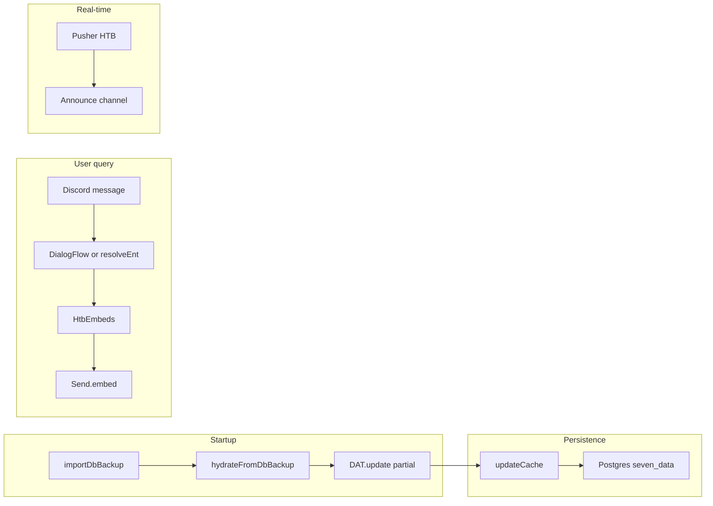

# Architecture

Seven is a Node.js Discord bot backed by Dialogflow NLP, an in-memory HTB cache, and PostgreSQL persistence.

## Data flow



## Startup sequence

1. **`importDbBackup()`** — reads JSON columns from Postgres table `seven_data`
2. **`DAT.hydrateFromDbBackup()`** — restores `MACHINES`, `CHALLENGES`, `TEAM_MEMBERS`, `MISC`, etc.
3. **`DAT.update()`** — fetches only **missing** sections from HTB API (partial bootstrap)
4. **Discord login** — `client.login(BOT_TOKEN)`
5. **Pusher subscribe** — real-time achievement feed using `HTB_V4_TOKEN`
6. **Hourly refresh** — `DAT.update({ force: true })` on interval

## Module responsibilities

| Module | Role |
|--------|------|
| `bot.js` | Discord events, intent switch, admin guards, cache persistence triggers |
| `models/SevenDatastore.js` | Cache shape, sync orchestration, filters, entity resolution |
| `modules/htb-api.js` | HTTP client for HTB v4/v5, auth, rate limiting, machine hybrid fetch |
| `modules/send.js` | Typing indicators, embed delivery, passthru/pickle modes |
| `views/embeds.js` | All Discord embed builders |
| `helpers/nlp.js` | Local intent resolution before/after DialogFlow |
| `helpers/dflow.js` | Sync HTB entities to Dialogflow for name recognition |
| `helpers/pusher-htb.js` | Parse Pusher events, post to announce channel |
| `helpers/chart-messages.js` | Build chart embeds with graceful Puppeteer failure |
| `modules/charts/index_new.js` | Highcharts → PNG via Puppeteer |

## Cache shape

```javascript
DAT.MACHINES           // { [id]: Machine }
DAT.CHALLENGES         // { [id]: Challenge }
DAT.TEAM_MEMBERS       // { [id]: TeamMember }
DAT.TEAM_MEMBERS_IGNORED
DAT.TEAM_STATS         // Team object
DAT.MISC.FORTRESSES
DAT.MISC.ENDGAMES
DAT.MISC.PROLABS
DAT.MISC.MACHINE_TAGS
DAT.D_STATIC           // Discord ↔ HTB links (persisted)
DAT.LAST_UPDATE        // Per-section timestamps
```

## Sync modes

See [htb-api.md](htb-api.md) for API details. Summary:

| Option | When |
|--------|------|
| Default | Startup — missing sections only |
| `{ force: true }` | Hourly, `force update` — team + deps |
| `{ full: true }` | `clear cache` — all 5 sections |
| `{ sections: [...] }` | Explicit section list |

Order: `machines → specials → tags → team → challenges`

## Postgres backup

Table `seven_data` stores JSON blobs per entity type. `updateCache()` writes after sync; `importDbBackup()` reads on startup. Manual fields (`discord_links`, `team_members_ignored`) are not overwritten by HTB sync.

## Discord integration

- **Guild** — `DISCORD_GUILD_ID` for member ID resolution
- **Announce** — `DISCORD_ANNOUNCE_CHAN_ID` for Pusher events
- **Emoji** — `EMOJI_GUILD_ID` for custom HTB icons via `admin.setupEmoji`

## Optional API server

When `API_SERVER_ENABLED=true`, `modules/seven-api-server.js` exposes Express routes with Discord OAuth. Disabled by default.

## Further reading

- [HTB API integration](htb-api.md)
- [Intent reference](intents.md)
- [AGENTS.md](../../AGENTS.md)
